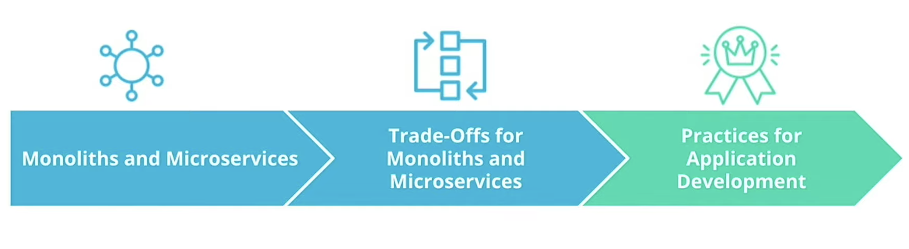
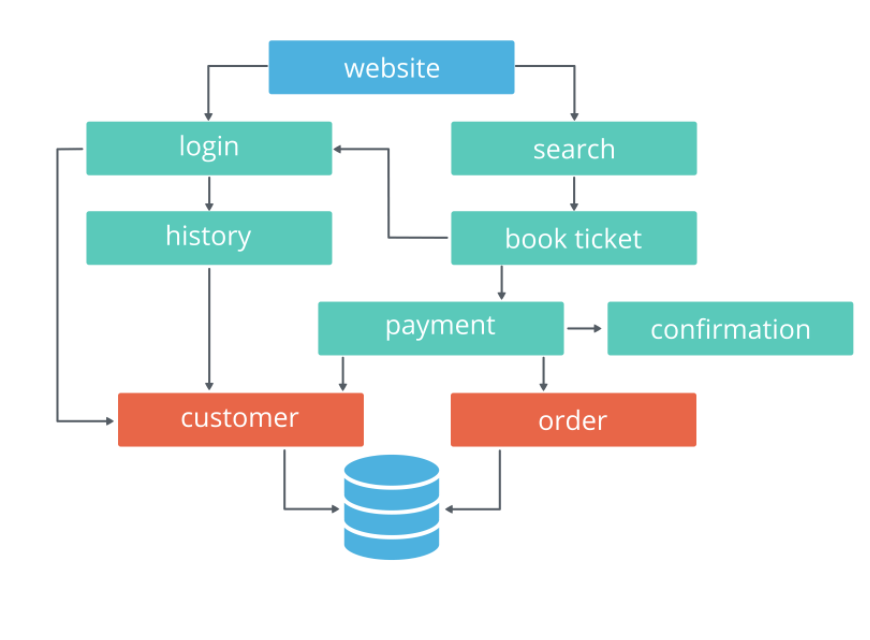

> Cloud Native Fundamentals  
> Udacity // Cloud Native Fundamentals Scholarship Program

[TOC]

# Lesson 1: Introduction to Cloud-Native Fundamentals

## Introduction to Cloud Native

> Cloud-Native  
> Set of practices that empowers an organization to buil and manage applications at scale

Can be achieved by using private, hybrid or public cloud providers and in addition to scaling, the organization needs to be agile in integrating customer feedback and adaptability to the surrounding technology ecosystem.

Containers and cloud-native go hand-in-hand. Containers are used to run a single application with all its dependencies which makes it easy to manage, deploy and recover quickly. With that said, you will see a often see a microservice-based architecture with cloud-native tooling as you can manage and configure services in a container easily packaged and ready to be executed.

## CNCF and Cloud-Native Tooling

**Container Orchestrators** appeared over time to make it easy to manage containers, such as:
- Docker Swarm
- Apache Mesos
- Kubernetes (winner)

**Kubernetes**

_Automates_:
- Configuration
- Management
- Scalability

_Solutionizes the integration of the following functionalities_:
- Runtime: application execution environment
- Networking: application connectivity
- Storage: application resources
- Service Mesh: granular control for the traffic within a cluster
- Logs and Metrics: construct the observability stack
- Tracing: building the full request journey

> CNCF  
> Cloud Native Computing Foundation

- Founded in 2015
- Vendor-neutral home for open source projects like:
	- Kubernetes
	- Prometheus
	- ETCD
	- Envoy
	- and more (1,300)

## Stakeholders

Always consider the main stakeholders when adopting cloud-native tooling and principles. We need to evaluate the key-points assessed from a business and technical prospective before integrating.

Cloud-native tooling adoption has increased because of rapid delivery of value to customers and the ease to adjust and extend based on requirements.

**Business Stakeholders**
- Agility: perform strategic transformations
- Growth: quickly iterate on customer feedback
- Service Availability: ensures the product is available to customers 24/7

**Technical Stakeholders**
- Automation: release a service without human intervention
- Orchestration: introduce a container orchestrator to manage thousands of services with minimal effort
- Observability: ability to independently troubleshoot and debug each component

# Lesson 2: Architecture Consideration for Cloud-Native Applications

## Introduction

Before starting to build an application we have to go through to a design phase to identify the main requirements and architecture with the availability of resources; **Monolith** or **Microservices**.

	

## Design Considerations for Cloud-Native Applications

**Design Considerations**

_Functional Requirements_
What capabilities should the application deliver to end-users. 
Good starting point is to expand on the following:
- Stakeholders
- Functionalities
- End Users
- Input and Ouput Process
- Engineering Teams

_Available Resources_
Go over what can be used in facilitating the implementation.
Good starting point is to list available:
- Engineering Resources
- Financial Resources
- Timeframes
- Internal Knowledge

## Monoliths and Microservices

Regardless of of the adopted structure, the goal is to design an application that delivers value to the customer and is agile.

At the same time either architecture encapsulates the three main tiers:
- UI (User Interface): handle HTTP requests from the users and returns a response
- Business Logic: contained code that provides a service to the users
- Data Layer: implement access and storage of data objects

### Monolith

An application design where all application tiers are managed as a single unit.

Consisting of:
- Same unit
- Business Logic
	- Managed by a single repository
	- Sharing existing resources (e.g. CPU and Memory)
	- Developed in one programming language
- Released using a single binary

	

### Microservice

An application design where application tiers are managed as independent, smaller units.

Consisting of:

- Small and Independent Units
- Separate Service
  - Own allocated resources (e.g. CPU and Memory)
  - Well-defined API (Application Programming Interface)
  - Programming language agnostic
  - Released using its own binary

	

### Additional Resources

**[What’s the Difference Between Monolith and Microservices?](https://nordicapis.com/whats-the-difference-between-monolith-and-microservices/)**  
**[Microservices vs Monolithic Architecture](https://www.mulesoft.com/resources/api/microservices-vs-monolithic)**

## Trade-offs for Monoliths and Microservices

