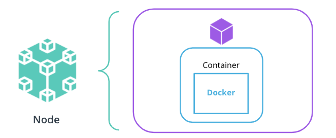

> Cloud Native Fundamentals  
> Udacity // Cloud Native Fundamentals Scholarship Program

[TOC]

# Lesson 1: Introduction to Cloud-Native Fundamentals

## Introduction to Cloud Native

> Cloud-Native  
> Set of practices that empowers an organization to buil and manage applications at scale

Can be achieved by using private, hybrid or public cloud providers and in addition to scaling, the organization needs to be agile in integrating customer feedback and adaptability to the surrounding technology ecosystem.

Containers and cloud-native go hand-in-hand. Containers are used to run a single application with all its dependencies which makes it easy to manage, deploy and recover quickly. With that said, you will see a often see a microservice-based architecture with cloud-native tooling as you can manage and configure services in a container easily packaged and ready to be executed.

## CNCF and Cloud-Native Tooling

**Container Orchestrators** appeared over time to make it easy to manage containers, such as:
- Docker Swarm
- Apache Mesos
- Kubernetes (winner)

**Kubernetes**

_Automates_:
- Configuration
- Management
- Scalability

_Solutionizes the integration of the following functionalities_:
- Runtime: application execution environment
- Networking: application connectivity
- Storage: application resources
- Service Mesh: granular control for the traffic within a cluster
- Logs and Metrics: construct the observability stack
- Tracing: building the full request journey

> CNCF  
> Cloud Native Computing Foundation

- Founded in 2015
- Vendor-neutral home for open source projects like:
	- Kubernetes
	- Prometheus
	- ETCD
	- Envoy
	- and more (1,300)

## Stakeholders

Always consider the main stakeholders when adopting cloud-native tooling and principles. We need to evaluate the key-points assessed from a business and technical prospective before integrating.

Cloud-native tooling adoption has increased because of rapid delivery of value to customers and the ease to adjust and extend based on requirements.

**Business Stakeholders**
- Agility: perform strategic transformations
- Growth: quickly iterate on customer feedback
- Service Availability: ensures the product is available to customers 24/7

**Technical Stakeholders**
- Automation: release a service without human intervention
- Orchestration: introduce a container orchestrator to manage thousands of services with minimal effort
- Observability: ability to independently troubleshoot and debug each component

# Lesson 2: Architecture Consideration for Cloud-Native Applications

## Introduction

Before starting to build an application we have to go through to a design phase to identify the main requirements and architecture with the availability of resources; **Monolith** or **Microservices**.

<div align="center">
	
</div>

## Design Considerations for Cloud-Native Applications

**Design Considerations**

_Functional Requirements_
What capabilities should the application deliver to end-users. 
Good starting point is to expand on the following:
- Stakeholders
- Functionalities
- End Users
- Input and Ouput Process
- Engineering Teams

_Available Resources_
Go over what can be used in facilitating the implementation.
Good starting point is to list available:
- Engineering Resources
- Financial Resources
- Timeframes
- Internal Knowledge

## Monoliths and Microservices

Regardless of of the adopted structure, the goal is to design an application that delivers value to the customer and is agile.

At the same time either architecture encapsulates the three main tiers:
- UI (User Interface): handle HTTP requests from the users and returns a response
- Business Logic: contained code that provides a service to the users
- Data Layer: implement access and storage of data objects

### Monolith

An application design where all application tiers are managed as a single unit.

Consisting of:
- Same unit
- Business Logic
	- Managed by a single repository
	- Sharing existing resources (e.g. CPU and Memory)
	- Developed in one programming language
- Released using a single binary

<div align="center">
	
</div>

### Microservice

An application design where application tiers are managed as independent, smaller units.

Consisting of:

- Small and Independent Units
- Separate Service
  - Own allocated resources (e.g. CPU and Memory)
  - Well-defined API (Application Programming Interface)
  - Programming language agnostic
  - Released using its own binary

<div align="center">
	
</div>

### Additional Resources

**[What’s the Difference Between Monolith and Microservices?](https://nordicapis.com/whats-the-difference-between-monolith-and-microservices/)**  
**[Microservices vs Monolithic Architecture](https://www.mulesoft.com/resources/api/microservices-vs-monolithic)**

## Trade-offs for Monoliths and Microservices

### Development Complexity

Effort required to deploy and manage an application

**Monolith**  
One programming language; one repository; enables sequential development

**Microservice**  
Multiple programming languages; multiple repositories; enables concurrent development

---

### Scalability

Captures how an application scales under load

**Monolith**  
Replication of the **entire stack**; heavy on resource consumption

**Microservice**  
Replication of a single unit, providing on-demand consumption of resources

---

### Time to Deploy

Encapsulates the build of a delivery pipeline to shit features

**Monolith**  
One delivery pipeline that deploys entire stack; more risk with each deployment leading to a lower velocity rate

**Microservice**  
Multiple delivery pipelines that deploy separate units; less risk with each deployment leading to a higher velocity rate

---

### Flexibility

Ability to adapt to new technologies and introduce new functionalities

**Monolith**  
Low rate, since the entire application stack might need restructuring to incorporate new functionalities 

**Microservice**  
High rate, since changing an independent unit is straightforward

---

### Operational Costs

Represents cost of necessary resources to release a product

**Monolith**  
Low initial cost, since one code base and one pipline should be managed, though the cost increases exponentially when the application needs to operate at scale

**Microservice**  
High initial cost, since multiple repositories and pipelines require management, but at scale, the cost remains proportional to the consumed resources at the point in time

---

### Reliability

Practices for an application to recover from failure and tools to monitor an application

**Monolith**  
When it fails, entire stack need to be recovered. Visibility into each functionality is low since logs / metrics are aggregaated

**Microservice**  
When it fails, only the unit of failure need recovering. High visilibity as logs / metrics are separated into their own unit

## Best Practices for Application Development

Regardless of chosen architecture, good development practices can be applied to improve the application lifecycle throughout the release and maintenance phases which will increase resiliency, provides transparency and lowers time to recovery.

### Health Checks

Showcase the status of an application and report if an application is running and meeting expected behavior, usually represented by an HTTP endpoints as `/healthz` or `/status`.

### Metrics

Necessary to quantify the performance of an application, making it mandatory to collect statistics on how the service is operating. Statistics can range from number of active users, handled requests or quantity of logs, but it is paramount to gather statistics on the resources the application requires to be fully operational. Usually the collection of this metrics are returned via an HTTP endpoint such as `/metrics`.

### Logs

Provides valuable insights into what operations a service is performing at a point in time, without them, troubleshooting and debugging would be an arduous process. Logs are usually collected from **STDOUT** (standard out) and **STDERR** (standard error) through a passive logging mechanism, meaning the output is sent to the shell, which can be collected by a logging tool such as Fluentd or Splunk and stored in a backend. Logs can also be directly sent to a backend storage via the application via an active logging technique.

There exists multiple logging levels but some of the more widely used are:

- **DEBUG** - record fine-grained events of application processes
- **INFO** - provide coarse-grained information about an operation
- **WARN** - records a potential issue with the service
- **ERROR** - notifies an error has been encountered, however, the application is still running
- **FATAL** - represents a critical situation, when the application is not operational

### Tracing

CApable of creating a full picture of how different services are invoked to fulfill a single request. Usually integrated at the application layer via a library where a developer can record when a particular services is invoked, defined as spans. A collection of spans defines the trace of the entire lifecycle request.

### Resource Consumption

Encapsulates the resources an application requires to be operational, usually referring to the amount of CPU and Memory that is consumed during its execution. Benchmarking network throughput or concurrent requests an application can handle is beneficial in having appropriate awareness for 24/7 uptime.

### Additional Resources

**[Health Checks](https://microservices.io/patterns/observability/health-check-api.html)**  
Explore the core reasons to introduce health checks and implementations examples

**[Prometehus Best Practices on Metrics Naming](https://prometheus.io/docs/instrumenting/writing_exporters/#metrics)**  
Explore how to name, label, and define the type of metrics

**[Application Logging Best Practices](https://logz.io/blog/logging-best-practices/)**  
Read more on how to define what logs should be collected by an application

**[Logging Levels](https://www.tutorialspoint.com/log4j/log4j_logging_levels.htm)**  
Explore possible logging levels and when they should be enabled

**[Enabling Distributed Tracing for Microservices With Jaeger in Kubernetes](https://containerjournal.com/topics/container-ecosystems/enabling-distributed-tracing-for-microservices-with-jaeger-in-kubernetes/)**  
Learn what tools can be used to implement tracing in a Kubernetes cluster

## Edge Case: Amorphous Application

After successfully releasing a product, the next phase in the application lifecycle is maintenance.

When considering adding new functionalities or incorporating new tools, it is always beneficial to focus on extensibility rather than flexibility. Generally speaking, it is more efficient to manage multiple services with a well-defined and simple functionality (as in the case of microservices), rather than add more abstraction layers to support new services (as we’ve seen with the monoliths).

<div align="center">
	
</div>

- A **split** operation - is applied if a service covers too many functionalities and it's complex to manage. Having smaller, manageable units is preferred in this context.
- A **merge** operation- is applied if units are too granular or perform closely interlinked operations, and it provides a development advantage to merge these together. For example, merging 2 separate services for log output and log format in a single service.
- A **replace** operation - is adopted when a more efficient implementation is identified for a service. For example, rewriting a Java service in Go, to optimize the overall execution time.
- A **stale** operation - is performed for services that are no longer providing any business value, and should be archived or deprecated. For example, services that were used to perform a one-off migration process.

### Additional Resources

**[Modern Banking in 1500 Microservices](https://www.youtube.com/watch?v=t7iVCIYQbgk)**  
Watch how Monzo is managing thousands of microservices and evolves their ecosystem


# Lesson 3: Container Orchestration with Kubernetes

## Transitions from VMs to Containers

<div align="center">
	
</div>

### VMs

Virtual Machines (VMs) were the main mechanism to host an application, as it encapsulated the code, config files and dependencies necessary to execute the application.

A VM is composed of an **operating sysmtem** (OS) with pre-installed libraries and packages that an application will utilize along with the OS filesystem.

VMs would be managed through a **hypervisor**, a software layer that provides virtualization of the infrastructure based on physical servers. Allowing the capability of creating, configuring and managing multiple VMs.

VMs introduced standardization in infrastructure provisioning. Instead of multiple servers, we can run multiple VMs as the same time through the hypervisor to host multiple applications, the downside being, it causes OS replication which consumes resources the more applications we run.

### Containers

A need to optimize the usage of the available infrastructure led the way to virtualizing the OS. Prompting the actualization for **containers**, representing the bare minimum an application requires.

Where we once had multiple VMs on a hypervisor, it's now replaced by multiple containers running on a single host operating system. Processes within the containers are completely isolated but are able to access the OS filesystem, resource and packages.

## Docker for Application Packaging

There are plenty of tools to containerize services, but Docker has set the industry standard for many years. To containerize an application with Docker, there are three main components: **Dockerfiles**, **Docker Image**, **Docker Registries**

### Dockerfile

Set of instructions used to create the Docker image, instructing dependencies to install, code to compile or impersonate a user. The Docker image being composed of multiple layers as instructions in the Dockerfile, with all layers being cached and only updating a layer at build if the instruction is modified.

Use pre-defined instructions when constructing a Dockerfile such as:

```Dockerfile
FROM   # Sets the base image
RUN    # Command to execute
COPY   # Copy files from host to container
CMD    # Set default command to execute at container start
EXPOSE # Expose an application port
```

_SAMPLE_

```Dockerfile
FROM python:3.8
LABEL maintainer="CodigoMatriz"

COPY . /app
WORKDIR /app
RUN pip install -r requirements.txt

CMD [ "python", "app.py" ]
```

### Docker Image

With our Dockerfile constructed, we use these instructions to build a **Docker Image**, which is a read-only template that enables creating a runnable instance of an application.

_SYNTAX_

```sh
# build an image
# OPTIONS - optional;  define extra configuration
# PATH - required;  sets the location of the Dockefile and  any referenced files 
docker build [OPTIONS] PATH

# Where OPTIONS can be:
-t, --tag - set the name and tag of the image
-f, --file - set the name of the Dockerfile
--build-arg - set build-time variables

# Find all valid options for this command 
docker build --help
```

_SAMPLE_

```sh
# build an image using the Dockerfile from the current directory
docker build -t python-helloworld .

# build an image using the Dockerfile from the `lesson1/python-app` directory
docker build -t python-helloworld lesson1/python-app
```

Once our Docker Image is built, it is best practice to test it locally by creating a container using `docker run`.

__SYNTAX__

```sh
# execute an image
# OPTIONS - optional;  define extra configuration
# IMAGE -  required; provides the name of the image to be executed
# COMMAND and ARGS - optional; instruct the container to run specific commands when it starts 
docker run [OPTIONS] IMAGE [COMMAND] [ARG...]

# Where OPTIONS can be:
-d, --detach - run in the background 
-p, --publish - expose container port to host
-it - start an interactive shell

# Find all valid options for this command 
docker run --help
```

Create a container for the Python "hello-world" application, which will run in detached mode (background) and expose it to port `5111` on the host.

```sh
docker run -d -p 5111:5000 python-helloworld
```

You can retrieve the container logs by running `docker logs {{ CONTAINER_ID }}`.

### Docker Registry

Once your image has been tested and is working as intended, it is time to push it  to a registry (public or private) like Dockerhub, AWS ECR, and so forth.

Do remember to tag your image, using `docker tag`, before pushing it, using `docker push`, to the registry as it provides version control and human-redable than the ID allocated by Docker.

_SYNTAX_

```sh
# tag an image
# SOURCE_IMAGE[:TAG]  - required and the tag is optional; define the name of an image on the current machine 
# TARGET_IMAGE[:TAG] -  required and the tag is optional; define the repository, name, and version of an image
docker tag SOURCE_IMAGE[:TAG] TARGET_IMAGE[:TAG]
```

```sh
# push an image to a registry 
# NAME[:TAG] - required and the tag is optional; name, set the image name to be pushed to the registry
docker push NAME[:TAG]
```

Tag and Push

```sh
# tag the `python-helloworld` image, to be pushed 
# in the `pixelpotato` repository, with the `python-helloworld` image name
# and version `v1.0.0`
docker tag python-helloworld pixelpotato/python-helloworld:v1.0.0

# push the `python-helloworld` application in version v1.0.0 
# to the `pixelpotato` repository in DockerHub
docker push pixelpotato/python-helloworld:v1.0.0
```

### Additional Resources

Explore Dockerfiles best practices and valid list of instructions:

-   [Dockerfile reference](https://docs.docker.com/engine/reference/builder/#from) 
-   [Best practices for writing Dockerfiles](https://docs.docker.com/develop/develop-images/dockerfile_best-practices/)

Explore how to build and run a Docker image, with a list of all available options:

-   [Docker Build command](https://docs.docker.com/engine/reference/commandline/build/)
-   [Docker Run command](https://docs.docker.com/engine/reference/commandline/run/)

Explore Docker registries, alternatives to package an application, and OCI standards:

-   [Introduction to Docker registry](https://docs.docker.com/registry/introduction/) 
-   [Docker Tag command](https://docs.docker.com/engine/reference/commandline/tag/)
-   [Docker Push command](https://docs.docker.com/engine/reference/commandline/push/)
-   [Demystifying the Open Container Initiative (OCI) Specifications](https://www.docker.com/blog/demystifying-open-container-initiative-oci-specifications/)
-   [Buildpacks: An App’s Brief Journey from Source to Image](https://buildpacks.io/docs/app-journey/)

## Kubernetes - The Container Orchestrator Framework

When deploying our containerized service, we must be aware that thousands and millions of users will be using it concurrently and as such we must build for scale. Managing this manually would be a nightmare, as it can be many containers that we'd need to keep up to date, check accessibility and health state which is why a container orchestrator framework comes in handy.

Handling the creation, managing and configuration of thousands of containers through distributed servers and having them communicate with each other is the work of the container orchestrator framework. Multiple tools exist to provide this service such as Docker Swarm, Rancher, Apache Mesos, etc. Among these, Kubernetes swooped in and became an industry leader solutionizing **portability**, **scalability**, **resilience**, **service discovery**, **extensibility**, and **operational cost** of containers.

### Solutions

#### Portability

Due to Kubernetes being open-source and vendor agnostic, it allows for high portability enabling it to be hosted on any infrastructure: public, private and hybrid cloud.

#### Scalability

Kubernetes has built-in resources like **HPA** (Horizontal Pod Autoscaler) to determined the required amount of replicas for a service. Scaling is the top-dog in moden infrastructure, which is why elasticity is a core feature highly automated within Kubernetes to enable an application to scale at use.

#### Resilience

Using functionalities like ReplicaSet, readiness, and liveness probes; Kubernetes enables self-healing to recover from failures fast while minimizing downtime.

#### Service Discovery

Providing a cluster level DNS (Domain Name System), simplifying access to the work within the cluster. Allowing Kubernetes to provide routing and load balancing to the requests the application needs to handle, adding the ability to automatically identify and access available services.

#### Extensibility

Using the building-block principle, it allows a set of basic resources to be easily adjusted. Providing an API that can be extended for new resources or CRDs (Custom Resource Definitions).

#### Operational Cost

Efficiency of resource consumption within a cluster like CPU and Memory. Providing a powerful scheduling mechanism that give an application on the node sufficient resources to execute with the given possibility to automatically scale the cluster size based on traffic done so by the cluster-autoscaler.

### Kubernetes Architecture

A cluster is composed of distributed physical and virtual servers called nodes, which are categorized as either master or worker nodes depending on the components installed on said nodes.

#### Control Plane

<div align="center>">
	
</div>

Suite of master nodes that make global decisions for the cluster.

**kube-apiserver**  
Exposes the Kubernetes API, handling and triggering operations within the cluster

**kube-scheduler**  
Mechanism that provisions the resource requirements of workloads on a node

**kube-controller-manager**  
Handles controller processes and propogates the configuration to resources

**etcd**  
A key-value store for back-ups and manifests of the cluster

#### Data Plane

The compute used to host workloads.

**kubelet**  
Agent running on every node to notify the **kube-apiserver** the node is part of the cluster

**kube-proxy**  
Network proxy that ensures the workload on the node is accessible

Components, **kubelet** and **kube-proxy** are installed on all cluster nodes (master / worker) to keep **kube-apiserver** up-to-date of all nodes within the cluster and are accessible.

### Terms

- **CRD** - Custom Resource Definition provides the ability to extend Kubernetes API and create new resources
- **Node** - a physical or virtual server
- **Cluster** - a collection of distributed nodes that are used to manage and host workloads
- **Master Node** - a node from the Kubernetes control plane, that has installed components to make global, cluster-level decisions
- **Worker Node** - a node from the Kubernetes data plane, that has installed components to host workloads

### Additional Resources

**[Kubernetes DNS for Services and Pods](https://kubernetes.io/docs/concepts/services-networking/dns-pod-service/)**  
**[Kubernetes CRDs](https://kubernetes.io/docs/concepts/extend-kubernetes/api-extension/custom-resources/)**  
**[Kubernete Cluster Autoscaler](https://kubernetes.io/blog/2016/07/autoscaling-in-kubernetes/)**  
**[Kubernetes Architecture and Components](https://kubernetes.io/docs/concepts/overview/components/)**

## Kubeconfig

Contains the necessary cluster metadata and athentication details to query cluster objects. Usually stored under `~/.kube/config` directory but k3s stores it at `/etc/rancher/k3s/k3s.yaml`. If you'd like to custom set the location of the kubeconfig file, you may set it via the `--kubeconfig` flag with `kubectl` or via the `KUBECONFIG` environment variable.

### Distinct Sections

**Cluster**  
Contains the metadata such as the name, API server endpoint and certificate authority (CA)

**User**  
Details for whomever wants access to the cluster, like the user's name and authentication metadata (username, password, token, certificates)

**Context**  
When a users credentials are valid and the cluster is up, the user is linked to the cluster granting access to its resources. Can be specified via `current-context`, instructing which context (cluster & user) can be used to query they cluster.

### Example

```yaml
apiVersion: v1
# define the cluster metadata 
clusters:
- cluster:
    certificate-authority-data: {{ CA }}
    server: https://127.0.0.1:63668
  name: udacity-cluster
# define the user details 
users:
# `udacity-user` user authenticates using client and key certificates 
- name: udacity-user
  user:
    client-certificate-data: {{ CERT }}
    client-key-data: {{ KEY }}
# `green-user` user authenticates using a token
- name: green-user
  user:
    token: {{ TOKEN }}
# define the contexts 
contexts:
- context:
    cluster: udacity-cluster
    user: udacity-user
  name: udacity-context
# set the current context
current-context: udacity-context
```

### kubectl Commands

```sh
# Inspect  the endpoints for the cluster and installed add-ons 
kubectl cluster-info

# List all the nodes in the cluster. 
# To get a more detailed view of the nodes, the `-o wide` flag can be passed
kubectl get nodes [-o wide] 

# Describe a cluster node.
# Typical configuration: node IP, capacity (CPU and memory), a list of running pods on the node, podCIDR, etc.
kubectl describe node {{ NODE NAME }}
```

### Additional Resources

**[Cluster, This is Your Admin - Do you Read?](https://community.suse.com/posts/cluster-this-is-your-admin-do-you-read)**  
**[Organizing Cluster Access Using kubeconfig Files](https://kubernetes.io/docs/concepts/configuration/organize-cluster-access-kubeconfig/)**

## Kubernetes Resources - Part 1

Providing a rich collection of resources that are used to deploy, configure and manage an application.

- **Pods** - the atomic element within a cluster to manage an application
- **Deployments & ReplicaSets** - oversees a set of pods for the same application
- **Services & Ingress** - ensures connectivity and reachability to pods
- **Configmaps & Secrets** - pass configuration to pods
- **Namespaces** - provides a logical separation between multiple applications and their resources
- **Custom Resource Definition (CRD)** - extends Kubernetes API to support custom resources

### Application Deployment

The smallest manageable unit within a cluster that provides the execution environment for an application is called a **pod**. A container that executes an application from an OCI-compliant image is within a pod; **highly recommended to be a 1:1** relationship with pods and container at times there could be more than one. Pods are place on the cluster nodes, with a node being able to host multiple pods.

<div align="center">
	
</div>
#### Deployments and ReplicaSets

<div align="center">
	
</div>

A **Deployment** resource containing the specificication for the desired state of the application is necessary for application deployment unto the Kubernetes cluster. Through this resource we can also manage pods by a **ReplicaSet** resource that ensures the correct amount of replicas for the application are running.

Running the command: `kubectl create deployment`

```sh
# create a Deployment resource
# NAME - required; set the name of the deployment
# IMAGE - required;  specify the Docker image to be executed
# FLAGS - optional; provide extra configuration parameters for the resource
# COMMAND and args - optional; instruct the container to run specific commands when it starts 
kubectl create deploy NAME --image=image [FLAGS] -- [COMMAND] [args]

# Some of the widely used FLAGS are:
-r, --replicas - set the number of replicas
-n, --namespace - set the namespace to run
--port - expose the container port
```

**EXAMPLE**

```sh
# create a go-helloworld Deployment in namespace `test`
kubectl create deploy go-helloworld --image=pixelpotato/go-helloworld:v1.0.0 -n test
```

Headless pods, though not recommended, are not managed by a ReplicaSet and Deployment but are useful when creating testing pods. 

Running the command: `kubectl run`

```sh
# create a headless pod
# NAME - required; set the name of the pod
# IMAGE - required;  specify the Docker image to be executed
# FLAGS - optional; provide extra configuration parameters for the resource
# COMMAND and args - optional; instruct the container to run specific commands when it starts 
kubectl run NAME --image=image [FLAGS] -- [COMMAND] [args...]

# Some of the widely used FLAGS are:
--restart - set the restart policy. Options [Always, OnFailure, Never]
--dry-run - dry run the command. Options [none, client, server]
-it - open an interactive shell to the container
```

**EXAMPLE**

```sh
# example: create a busybox pod, with an interactive shell and a restart policy set to Never 
kubectl run -it busybox-test --image=busybox --restart=Never
```

#### Rolling Out Strategy

Ensuring no downtime is encountered of a new application version release, the Deployment resource has two strategies:

- **RollingUpdate** - updates the pods in a rolling out fashion (e.g. 1-by-1)
- **Recreate** - kills all existing pods before new ones are created

<div align="center">
	
</div>

1. The Go hello-world application is running version v1.0.0 in a pod managed by a ReplicaSet
2. The version of Go hello-world application is set to v2.0.0
3. A new ReplicaSet is created that controls a new pod with the application running in version v2.0.0
4. The traffic is directed to the pod running v2.0.0 and the pod with the old configuration (v1.0.0) is removed

### Additional Resources

**[Kubernetes Pods](https://kubernetes.io/docs/concepts/workloads/pods/)**  
**[Kubernetes Deployments](https://kubernetes.io/docs/concepts/workloads/controllers/deployment/)**  
**[Kubernetes ReplicaSets](https://kubernetes.io/docs/concepts/workloads/controllers/replicaset/)**  
**[Kubernetes RollingOut Strategies](https://kubernetes.io/docs/concepts/workloads/controllers/deployment/#strategy)**

## Kubernetes Resources - Part 2

One IP is allocated per pod ensuring connectivity and reachability to the application within the pod with is only routable inside the cluster, preventing external users and services to connect to the application.

We can connect a workload within the cluster to access a pod directly but if the pod dies, all requests will fail as the application is not running. This is where a **Service** resource comes into play to automate a workload to communicate with a different pod.

### Services

> Service  
> an abstraction layer over a collection of pods running an application

An abstraction layer over a collection of pods running an application, which is allocated a cluster IP that transfer traffic to any avialable pods for an application.

<div align="center">
	
</div>

As seen above, (1) the workload should access the (2) service IP which routes the request to (3) available pods.

Three widely used Service types:

**ClusterIP** exposes the service using a port exposed on all nodes in the cluster

**NodePort** expoeses the service using a port exposed on all nodes in the cluster

**LoadBalancer** exposes the service through a load balancer from a public cloud provider such as AWS, Azure or GCP. This will allow the external traffic to reach the services withint the cluster securely.

Running the command: `kubectl expose deployment`

```sh
# expose a Deployment through a Service resource 
# NAME - required; set the name of the deployment to be exposed
# --port - required; specify the port that the service should serve on
# --target-port - optional; specify the port on the container that the service should direct traffic to
# FLAGS - optional; provide extra configuration parameters for the service
kubectl expose deploy NAME --port=port [--target-port=port] [FLAGS]

# Some of the widely used FLAGS are:
--protocol - set the network protocol. Options [TCP|UDP|SCTP]
--type - set the type of service. Options [ClusterIP, NodePort, LoadBalancer]
```

**EXAMPLE**

```sh
# expose the `go-helloworld` deployment on port 8111
# note: the application is serving requests on port 6112
kubectl expose deploy go-helloworld --port=8111 --target-port=6112
```

### Ingress

> Ingress  
> a mechanism to manage the access from external users and workloads to the services within the cluster

A resource necessary to allow an external user to access services within the cluster. Exposing HTTP and HTTPS routes to services witin the cluster via a load balancer provisioned by a cloud provider. Using a set of rules, HTTP(S) endpoints can be mapped to services in the cluster, and an **Ingress Controller** is used to keep the rules and load balancer up-to-date.

<div align="center">
	
</div>

Shown in the image above, the customers will access the *go-helloworld.com/hi* HTTP route (1), which is managed by an Ingress (2). The Ingress  Controller (3) examines the configured routes and directs the traffic to a LoadBalancer (4). And finally, the LoadBalancer directs the requests  to the pods using a dedicated port (5). 

### Additional Resources

**[Kubernetes Services](https://kubernetes.io/docs/concepts/services-networking/service/)**
**[Kubernetes Ingress](https://kubernetes.io/docs/concepts/services-networking/ingress/)**

## Kubernetes Resources - Part 3

### Application Configuration and Context

Good development practice is to separate the configuration from the source code, increasing the portability of an application as it becomes resilient to customer use cases. Kubernetes offers us two resources to pass data to an application: **ConfigMaps** and **Secrets**

#### ConfigMaps

Stores non-confidential data in key-value pairs, allowing a pod to consume the Configmap as an environment variable, configuration values via a volume mount or as a CLI argument to the container.

Running the command: `kubectl create configmap`

```sh
# create a Configmap
# NAME - required; set the name of the configmap resource
# FLAGS - optional; define  extra configuration parameters for the configmap
kubectl create configmap NAME [FLAGS]

# Some of the widely used FLAGS are:
--from-file - set path to file with key-value pairs 
--from-literal - set key-value pair from command-line 
```

**EXAMPLE**

```sh
# create a Configmap to store the color value
kubectl create configmap test-cm --from-literal=color=yellow
```

#### Secrets

Stores and distributes sensitive data to the pods. Like ConfigMaps, Secrets can be consumed via environment variables or files via a volume mount. All secrets will be encoded in base64.

Running command: `kubectl create secret generic`

```sh
# create a Secret
# NAME - required; set the name of the secret resource
# FLAGS - optional; define  extra configuration parameters for the secret
kubectl create secret generic NAME [FLAGS]

# Some of the widely used FLAGS are:
--from-file - set path to file with the sensitive key-value pairs 
--from-literal - set key-value pair from command-line 
```

**EXAMPLE**

```sh
# create a Secret to store the secret color value
kubectl create secret generic test-secret --from-literal=color=blue
```

#### Namespaces

Via this resource, we can separate multiple applications and associated resources to allow separate execution environments across teams and business verticals. Provides the application context, which defines the environment for a group of Kubernets resources that relate to a project, like the amount of CPU, memory and access. This separation eliminates the use case where a team can consume all the available resources in the cluster if Namespace no boundaries are set.

Running the command: `kubectl create namespace`

```sh
# create a Namespace
# NAME - required; set the name of the Namespace
kubectl create ns NAME
```

**EXAMPLE**

```sh
# create a `test-udacity` Namespace
kubectl create ns test-udacity

# get all the pods in the `test-udacity` Namespace
kubectl get po -n test-udacity
```

### Additional Resources

**[Kubernetes Configmap](https://kubernetes.io/docs/concepts/configuration/configmap/)**
**[Kubernetes Secrets](https://kubernetes.io/docs/concepts/configuration/secret/)**
**[Kubernetes Namespaces](https://kubernetes.io/docs/concepts/overview/working-with-objects/namespaces/)**

